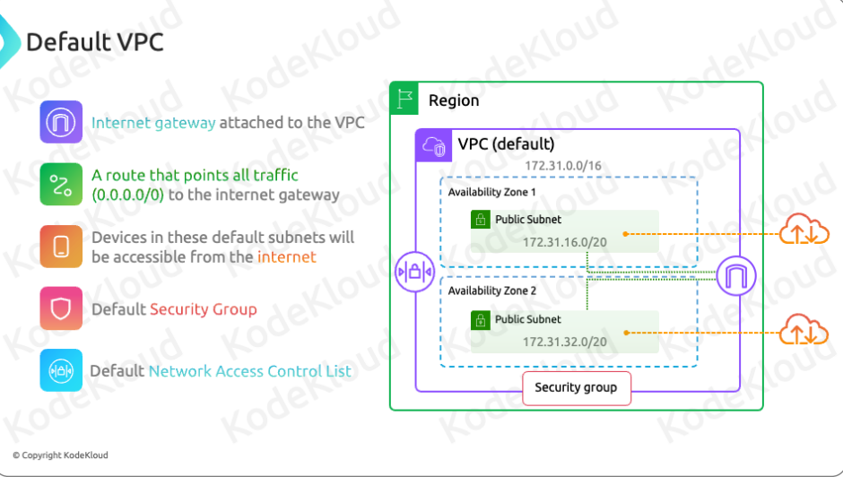

# Introduction to VPC

## Definition
Virtual Private Cloud (VPC) is a secure, isolated network segment within AWS.

## Purpose
- Isolate resources from other resources in the cloud.
- Ensure separation between resources of different customers and within a single customer's different applications.

# Features and Control

## Isolation
- Prevents one customer's resources from interacting with another's.
- Ensures apps within the same account can't communicate unless specified.

## Full Control
- **Subnetting**: Define IP address ranges.
- **Routing Tables**: Control packet paths within the AWS account.

## Security
- Firewalls (security groups and ACLs) manage traffic to and from resources.
- Gateways customize traffic flow (e.g., internet gateways, NAT gateways).

# Comparison to Physical Data Centers

## Similarity
- Comparable control over networking.
- Tasks like configuring routers and switches are streamlined by AWS.

## Simplification
- AWS simplifies the process, avoiding the need for direct command-line interface configurations.

# Region-Specific VPCs

- **Single Region**: VPCs are limited to one region.
  - Example: VPC1 in US East 1, VPC2 in US East 2.
- Important for the Solutions Architect Exam.

# Network Boundaries and Isolation

- **Automatic Isolation**: Resources in one VPC cannot communicate with those in another by default.
- **Explicit Communication**: Internet or inter-VPC communication must be explicitly enabled.

# IP Addressing and CIDR Blocks

## CIDR Block Definition
- Specifies IP addresses for resources in the VPC.
- Sizes range from /16 to /28.
  - Example: 192.168.0.0/16.

## Secondary Blocks
- Optional secondary IPv4 block.
- Up to five /56 IPv6 CIDR blocks, adjustable limits.

# Types of VPCs

## Default VPC
- Automatically configured by AWS.
- One per region, with default subnets, internet gateway, routing, security groups, and ACLs.
- Uses 172.31.0.0/16 CIDR block.
- Facilitates easy setup and initial access to the internet.

## Custom VPC
- Created and configured by the customer.
- Complete control over CIDR block, networking, and security settings.

# Default VPC Configuration

## Subnets
- One default subnet per availability zone, each with a /20 CIDR block.
  - Example: AZ1 (172.31.16.0/20), AZ2 (172.31.32.0/20).

## Internet Gateway
- Attached by default.
- Default route (0.0.0.0/0) for internet connectivity.

## Security
- Default security group allows outbound traffic.
- Default network ACL allows both inbound and outbound traffic.

# Summary

- **Isolation**: VPCs isolate computing resources.
- **Region Specific**: Tied to a specific region upon deployment.
- **CIDR Blocks**: Define IP address range, customizable during deployment.
- **Default VPCs**:
  - One per region, configured automatically with default subnets, security groups, and ACLs.
  - Use 172.31.0.0/16 CIDR block.
  - Subnets have outbound internet access by default.
  - Default security groups allow outbound traffic; default ACLs allow both directions.

---



---

### Questions 

- How cidr ip's are calculated ?
- What is use of secondary cidr block ?
- How will you take care of ip exhausition ?
- What is the primary difference between a public subnet and a private subnet in an AWS VPC?
```
In a VPC, a public subnet is associated with a route table that directs traffic to the internet via an Internet Gateway (IGW), making it accessible from the internet. 

A private subnet is not associated with an IGW and is intended for resources that should not be directly accessible from the internet.
```
- What is AWS VPC, and how does it enable network isolation and customization for cloud resources?
```
 AWS VPC is a logically isolated section of the AWS Cloud where you can launch AWS resources. It enables network isolation and customization by allowing you to define your network configuration, including IP address ranges, subnets, and route tables, providing control and security for your cloud resources.
```
- What is a VPC CIDR block, and why is it important when designing a VPC network?
```
 A VPC CIDR block is the IP address range you choose for your VPC. It’s a crucial aspect of network design, as it determines the address space available for your VPC and its subnets. Careful planning of the CIDR block is essential to avoid IP address conflicts and to align with your organization’s network structure.
```
