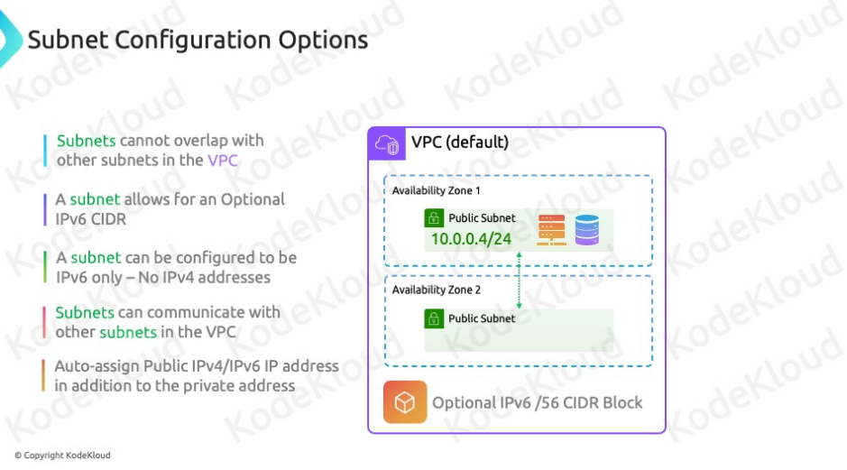

# Definition of Subnets

## Subnets
- Groups of IP addresses within a VPC.
- Used to deploy resources such as EC2 instances.

# Availability Zones

## Single Availability Zone
- Each subnet resides in one availability zone.
  - Example: Subnet 1 in Availability Zone 1; Subnet 2 in Availability Zone 2.
- Deployment to a specific subnet determines the availability zone of the resource.

# Public and Private Subnets

## Public Subnets
- Allow external access to resources.
  - Example: Web servers or web applications accessible to users.

## Private Subnets
- For resources that do not require external access.

# CIDR Blocks and Subnet Ranges

## CIDR Range
- Subnets must fall within the VPC's CIDR range.
  - Example: VPC with CIDR 192.168.0.0/16; valid subnet CIDR could be 192.168.10.0/24.

## Invalid Configuration
- Example: Subnet CIDR 10.101.0.0/24 would be invalid if the VPC CIDR is 192.168.0.0/16.

# IP Address Allocation

## Size Limits
- Subnet block size must be between /16 and /28.

## Reserved IP Addresses
- First four IP addresses and the last IP address in a subnet are reserved.
  - Example: For 192.168.10.0/24, reserved addresses include:
    - 192.168.10.0 (Network address)
    - 192.168.10.1 (VPC router)
    - 192.168.10.2 (DNS)
    - 192.168.10.3 (Future use)
    - 192.168.10.255 (Broadcast address)

# Overlapping Subnets

## Non-overlapping Requirement
- Subnets in the same VPC cannot overlap.
  - Example: 10.16.0.0/24 and 10.16.0.128/25 overlap and are invalid in the same VPC.

## Different VPCs
- Subnets can overlap with subnets in different VPCs.

# IPv6 Subnets

## IPv6 Configuration
- Subnets can have an IPv6 /56 CIDR block.
- Can be configured to use only IPv6 addresses.

# Communication and Public IP Assignment

## Default Communication
- Subnets can communicate with other subnets in the same VPC by default.

## Public IP Assignment
- Option to auto-assign a public IPv4/IPv6 address in addition to a private address.
- Useful for resources needing internet connectivity, such as web servers.

# Summary

## Subnets
- Ranges of IP addresses within a VPC, confined to a single availability zone.
- Can be public or private.

## Configuration
- Must be within the VPC’s CIDR range.
- Cannot overlap within the same VPC.
- Can use IPv4 and/or IPv6 addresses.

## Deployment
- Determines the availability zone of the resource.
- Public subnets are essential for resources needing internet access.

---

---
### Questions 

- 