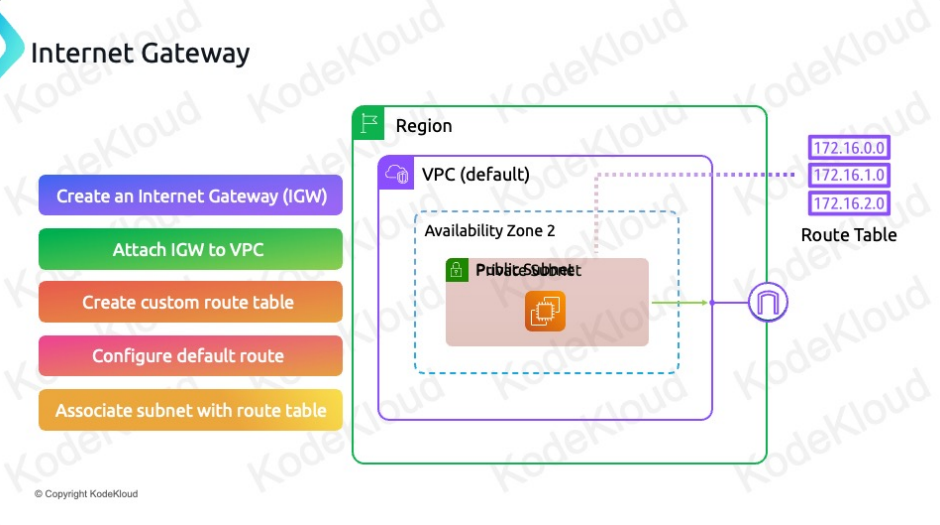

* AWS Internet Gateways and Public Subnets
    - Internet Gateways Overview
        - Purpose
            - Enable internet connectivity for resources in a VPC.
            - Convert private subnets into public subnets.
        - Characteristics
            - Region Resilient: Covers all availability zones within a region.
            - Attachment: One internet gateway per VPC; one VPC per internet gateway.
    - Making a Subnet Public
        - Steps
            - Create an Internet Gateway
                - First step to enable internet access.
            - Attach the Internet Gateway to the VPC
                - The internet gateway must be attached to the VPC containing the subnet.
            - Create a Custom Route Table
                - Define routing rules for the subnet.
            - Configure a Default Route
                - Add a default route (0.0.0.0/0) pointing to the internet gateway.
                - Ensures traffic not matching specific routes is sent to the internet gateway.
            - Associate the Route Table with the Subnet
                - Link the custom route table to the subnet for internet access.
    - Assigning Public IP Addresses
        - Default Behavior
            - Resources in a public subnet only get a private IP by default.
        - Enable Public IP
            - Option to auto-assign a public IP when launching resources.
            - Public IP is associated with the private IP and managed by AWS.
            - Resources only recognize the private IP.
    - How Public and Private IPs Work Together
        - Translation
            - Requests to the public IP are translated by AWS and forwarded to the private IP.
        - Resource Awareness
            - Resources only know their private IP.
            - Public IPs are managed and abstracted by AWS.
    - Key Points to Remember
        - Internet Gateway
            - Provides internet connectivity and converts subnets to public.
            - One internet gateway per VPC and one VPC per internet gateway.
        - Route Table
            - Custom route table with a default route to the internet gateway is required to make a subnet public.
        - Public IP Assignment
            - Enable auto-assign public IP option for internet accessibility.
            - Public IPs are linked to private IPs and managed by AWS.
    - Summary
        - Internet Gateway
            - Enables VPC resources to connect to the internet.
            - Attached to the VPC and is region resilient.
            - One internet gateway per VPC.
        - Making Subnets Public
            - Create and attach an internet gateway.
            - Create a custom route table and configure a default route to the internet gateway.
            - Associate the custom route table with the subnet.
        - Public IPs
            - Resources in public subnets get private IPs by default.
            - Enable auto-assign public IP option for internet accessibility.
            - Public IPs are linked to private IPs and managed by AWS.

