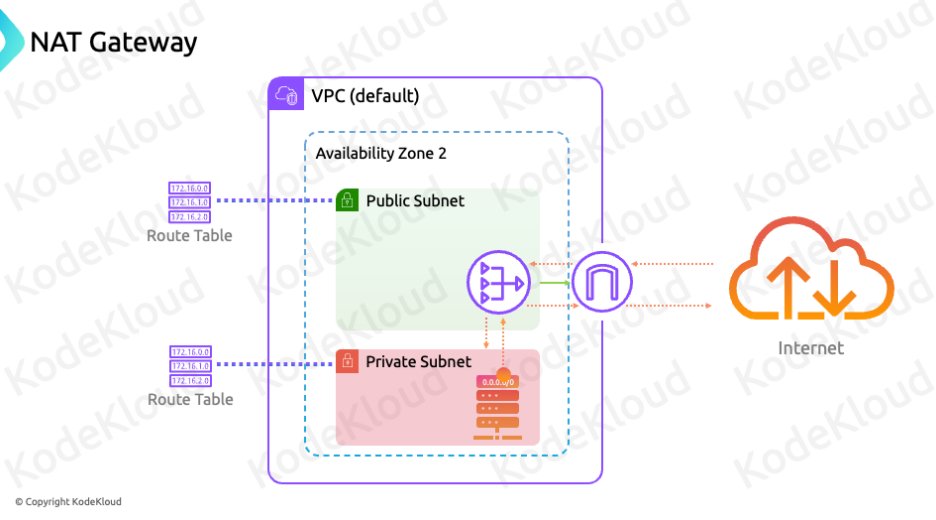
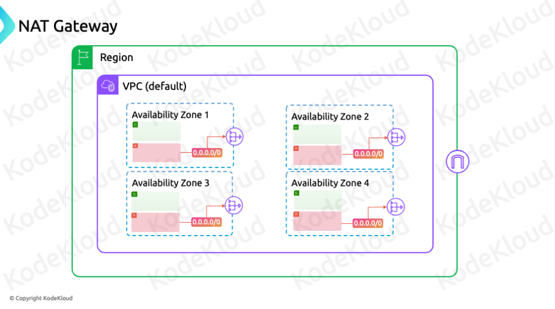

* AWS NAT Gateways
    - Overview
        - Purpose
            - Enable internet connectivity for servers in private subnets to download updates and security patches.
            - Ensure servers can initiate connections to the internet without being open to incoming internet traffic.
        - Characteristics
            - Region Resilient: NAT Gateways require an Internet Gateway.
            - Attachment: Deployed in a public subnet; accessible by private subnets through routing.

    - Making a Subnet Public with NAT Gateways
        - Steps
            - Create an Internet Gateway
                - First step to enable internet access.
            - Attach the Internet Gateway to the VPC
                - Must be attached to the VPC containing the subnet.
            - Create a Public Subnet
                - Default route pointing to the internet gateway.
            - Deploy NAT Gateway onto Public Subnet
                - NAT Gateway has full access to the internet.
            - Configure Route for Private Subnet
                - Default route pointing to the NAT Gateway.

    - Assigning Public IP Addresses
        - Default Behavior
            - Resources in a public subnet get private IPs by default.
        - Enable Public IP
            - Auto-assign public IP option when launching resources.
            - Public IP is managed by AWS and associated with the private IP.

    - How Public and Private IPs Work Together
        - Translation
            - Requests to the public IP are translated by AWS and forwarded to the private IP.
        - Resource Awareness
            - Resources only recognize their private IPs.
            - Public IPs are managed and abstracted by AWS.

    - Key Points to Remember
        - Internet Gateway
            - Necessary for NAT Gateway to access the internet.
            - One internet gateway per VPC and one VPC per internet gateway.
        - Route Table
            - Custom route table with a default route to the NAT Gateway is required for private subnet internet access.
        - Public IP Assignment
            - Enable auto-assign public IP option for resources in public subnets for internet accessibility.
            - Public IPs are linked to private IPs and managed by AWS.

    - Summary
        - NAT Gateways
            - Allow servers in private subnets to access the internet.
            - Require an internet gateway.
            - Deployed in a public subnet.
            - Managed service by AWS.
            - Charge per hour and per gigabyte of data processed.
            - Not region resilient; deploy in multiple availability zones for redundancy.
        - Route Table for Private Subnets
            - Default route pointing to the NAT Gateway.
            - Ensures private subnets can access the internet while remaining secure from incoming internet traffic.
        - Billing and Performance
            - Billed per hour and per gigabyte of data processed.
            - Supports 5 Gbps of bandwidth, scales up to 100 Gbps.

